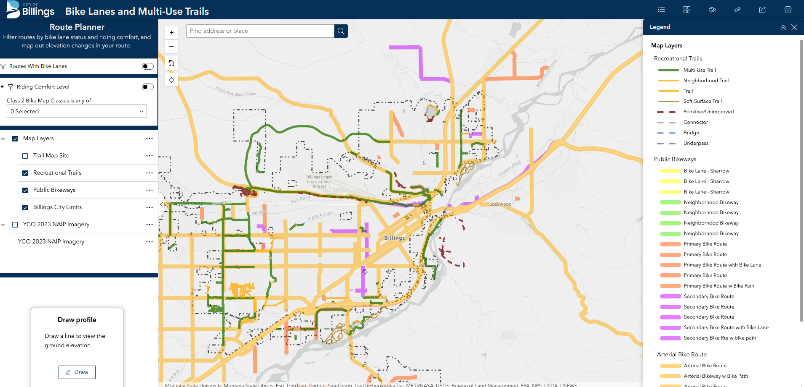
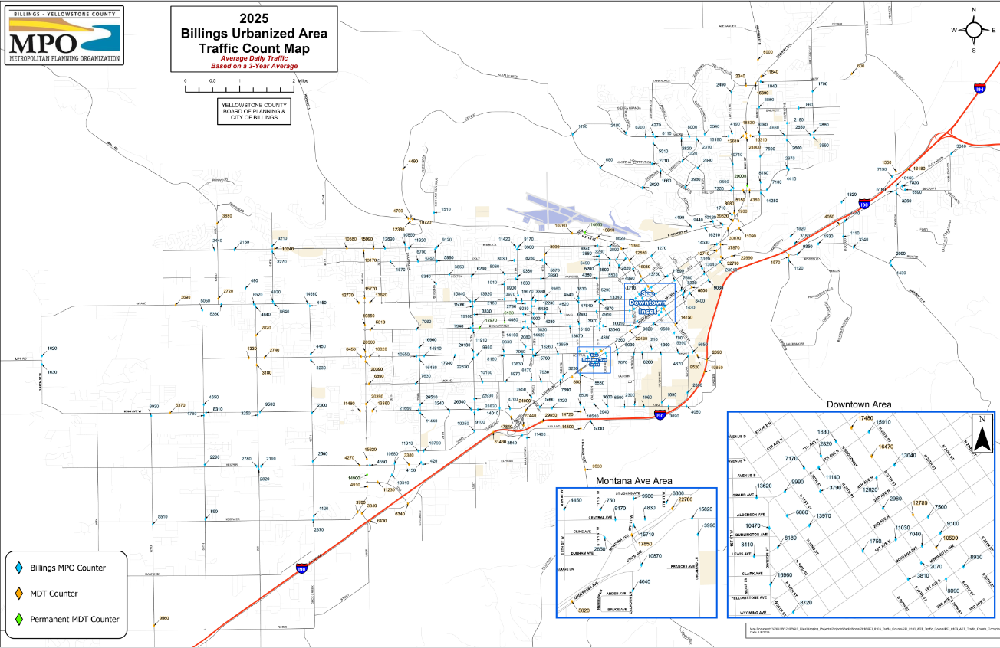

# About me

I'm an early career GIS professional specializing in Enterprise and Web GIS. I enjoy solving difficult problems with a bit of research, a bit of code, and a bit of elbow grease!

I'm looking to contribute my skills to a forward-thinking organization I can be proud of as an employee. Please feel free to explore the tabs below.

  <button class="tab-button active" onclick="openTab(event, 'tab1')">Esri REST Service ETL Pipeline</button>
  <button class="tab-button" onclick="openTab(event, 'tab2')">Data Governance Sample Script</button>
  <button class="tab-button" onclick="openTab(event, 'tab3')">Personal Interests</button>
  <button class="tab-button" onclick="openTab(event, 'tab4')">Other Examples of Work</button>

 
  
  
  
  {{ notebook | markdownify }}

  
  
  
  {{ notebook | markdownify }}

  <strong>I enjoy learning about and visualizing planning and urban design concepts, like in this map that displays data on</strong>
    <strong>zoning restrictiveness in over 2,800 municipalities across the United States.</strong>
    

    
Click a municipality to view more information.
  
  

    <iframe 
      src="zri_index_map.html" 
      width="100%" 
      height="750px" 
      style="border:none; display:block;" 
      loading="lazy">
    </iframe>
    
  
  <strong> I also extend my passion for mapping into the realm of fantasy!</strong>
  

    
  

  <strong> City of Billings Zoning Information Map </strong>
  
  <a href = "https://experience.arcgis.com/experience/9e1c23b36950488687bc3478798fce95" target="_blank"><u>Click to View Full Map</u></a>
    
   
  <strong> City of Billings Bike Lane and Multi Use Trail Map </strong>
  
  <a href = "https://experience.arcgis.com/experience/9a1ccac651374d4081b5e5ad3996c064" target="_blank"><u>Click to View Full Map</u></a>
    
   
  <strong> City of Billings Traffic Count Map </strong>
  
  <a href = "https://www.billingsmt.gov/DocumentCenter/View/55565/2025-Traffic-Count-Map" target="_blank"><u>Click to View Full Map</u></a>
  

